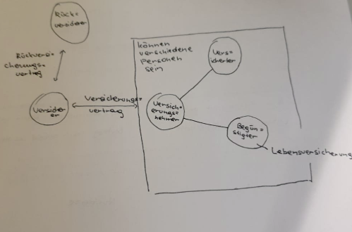

# Test 3AHIF Fragen + Antworten
### 1. Frage
   #### a) Stelle anhand von 2 wesentlichen/typischen Unterschieden die Individual- und die Sozialversicherung einander gegenüber: 
    
* Individualversicherung: 
  * Vertragsabschluss freiwillig
  * Beitrag je nach Risikohöhe
  * Leistungen individuell vereinbar
  * Prämie des Versicherungsnehmer soll alle Kosten decken
  * im Privatrecht geregelt

* Sozialversicherung: 
  * entsteht kraft Gesetzes
  * Beitrag nach sozialen Grundsätzen
  * Leistungen nicht inidividuell vereinbar
  * Arbeitgeber und Arbeitnehmer zahlen Beiträge, Staat leistet Zuschüsse
  * im öffentlichen Recht geregelt

#### b) Stelle mithilfe einer Grafik dar, wer an Versicherungsverträgen direkt oder indirekt beteiligt sein kann. Zeige durch Pfeile, wie diese Beteiligten zusammenhängen (und gib dazu auch wenn wirklich notwendig, eine kurze Erklärung)

### 2. Frage
#### a) Der Unternehmer [...] hat sein Geschäfts- und sein Privatkonto bei der Sparkasse. Gib _jeweils 1 praktisches Beispiel_ für [  -   ] ein: 
* Aktivgeschäft: Kredit geben, Kreditgeschäft
* Passivgeschäft: Geld einlegen, Einlagengeschäft
* Dienstleistungsgeschäft: Zahlungsverkehr im In-/Ausland, Verwahrung(Schließfächer, Wertpapierdepots), Handel(Wertpapiere)
* Eigengeschäft: zb Immobilien erwerben

