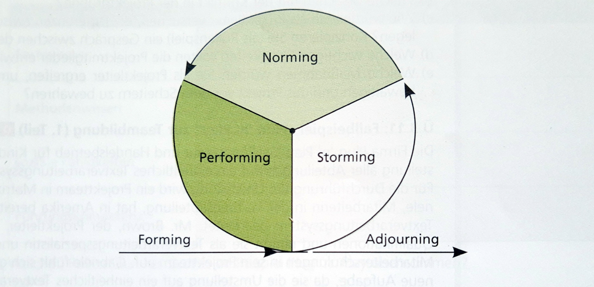
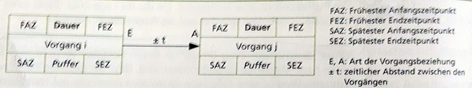

# SYPTEST
##### Jahr 3/Semester 1/Test 2
##### Lehrer -> Hammer
##### Fach -> Syp
> Zusammenfassung des Teststoffes:
> * Projektstart
> * Organisationsformen (Vor-/Nachteile, Probleme)
> * Phasen des Teambuildings
> * Strukturplan
> * Arbeitspaket
> * Tasks
> * Zeitplanung

## Projektstart 
### Die Bedeutung und die verfolgten Ziele
Der Projektstart ist sehr wichtig für das Projekt, weil: 
* Fehler in dieser Phase sind schwer korrigierbar
* diese Phase beeinflusst das ganze Projekt sehr stark
### Aufgaben des Projektstarts
Aufgabe ist, möglichst früh einen hohen Wissenstand aller Beteiligten zu erreichen, alle Bereiche vollständig zu klären und grundlegende Weichenstellungen für das Projekt vornehmen zu können.
### Die Formen des Projektstarts
* Projekt-Start-up-Seminar: 
  * Das Seminar dient zur Infor über Entstehungsgeschichte, Ziele und Umfeld des Projekts, fachliche Infos werden von den jeweiligen Spezialisten vorgetragen. Im Rahmen einer Diskussion sind Unklarhieten beseitigen, Ziele konkretisieren und mögliche Probleme/Risiken zu behandeln. Sollte von einem Moderator geleitet werden.
* Projekt-Start-up Workshop:
  * Kann einige Tage dauern und erfolgt extern. Er hat folgende Aufgaben:
    * "Wir-Gefühl" und gutes Arbeitsklima herstellen
    * Konflikte im Team zu erkennen
    * Konzentration auf das Projekt fördern
    * Projektplanung durchführen(Zeit-/Ressourcenplanung, Projektstrukturierung)
    * Rollen im Team definieren
    * Projektkommunkation einreichten
  * Maximal 15 der wichtigsten Projektbeteiligten sollten teilnehmen. Ein externer Berater sollte moderieren. Oft wird auch ein *Kick-off-Meeting* durchgeführt. Es kennzeichnet den Projektstart. 

## Organisationsformen
Es gibt 4 Arten von Projektorganisationsformen: 
1. reine Projektorganisation(Task-Force)
   * alle Mitarbeiter sind  verantwortlich
   * während der Projektdauer sind Mitarbeiter ihren Vorgesetzten nicht unterstellt
   * Projektleiter verantwortet Projekt nach außen
   * Einsatzbereiche: 
     * umfangreiche, lange Projekte
     * Projekte mit hoher strategischer Bedeutung für das Unternehmen
     * Projekte mit hoher technologischer Komplexität
     * zeitkritische oder unter Zeitdruck stehende Projekte
   * Vorteile: 
     * rasche Problemlösung
     * Konzentration der Beteiligten auf die Durchführung ist gut möglich
     * eindeutige Regelung von Kompetenzen und Aufgaben des Projektleiters
   * Nachteile und Probleme:
     * Mitarbeiter sind meist über die gesamte Projektdauer Mitglieder der Projektgruppe; die Auslastung der Personalressource ist daher meist nicht optimal
     * besonders bei langen Projekten stellt die Wiedereingliederung der Mitglieder in die Linienorganisation ein Problem dar. Die ehemaligen Funktionen könnten neubesetzt worden sein
     * Mitglieder benötigen evtl. Infos aus ihrer Stammabteilung. Das könnte als Störung empfunden werden
     * wenn viele oder bestqualifizierte Mitarbeiter aus der LInienorganisation für Projekte hergenommen, besteht die Gefahr, dass die Verrichtung der Linie darunter leidet
     * => Abteilungen werden nicht die besten Mitarbeiter freistellen, sondern eher Mittelmäßige. Das bedeutet Risiko für das Projekt
2. Einflussprojektorganisation
   * eine möglichst geringe organisatorische Änderung innerhalb der LLinienorganisation ist erwünscht
   * wird auch als Stabs-Projektorganisation bezeichnet - weil die Projektleitung in kompetenzmäig abgeschwächter Form als Projektkoordination im Rahmen einer Stabsstelle der Linienorganistation erfüllt wird
   * alle Mitglieder bleiben in der funktionalen Hierarchie des Unternehmens - sie erledigen ihre normalen Aufgaben und die Projektaufgaben gleichzeitig
   * der Projektleiter plant den Projektablauf und überwacht ihn(Termine, fachliches, und finanziell)
   * der Projektkoordinator hat keine formalen Entscheidungs- und Weisungskompetenzen
   * Einsatzbereiche: 
     * gut strukturierte Projekte, welche repetitiv sind
     * Projekte mit geringem Umfang, wenig Risiko und geringem Innovationsgrad
   * Vorteile:
     * geringer Organisationsaufwand
     * personelle Kapazität der Mitarbeiter kann flexibel ausgelastet werden
     * gleichzeitige Abwicklung mehrerer Projekte ist möglich
   * Nachteile/Probleme: 
     * Bindung der Mitarbeiter an die Abteilung ist stärker als die Identifikation mit dem Projekt -> Abteilungsübergreifende Problemlösungen werden erschwert
     * Der Projektkoordinator trägt Verantowrtung für den Projekterfolg, ihm fehlen aber die formalen Kompetenzen den Projektverlauf durch Anweisungen direkt zu beeinflussen
     * Probleme zwischen Koordinator und Mitglieder muss über die vorgesetzte Stelle ablaufen -> verringert Bereitschaft zur Konfliktlösung
     * Lösung eines Konfliktes belastet auch die vorgesetzte Stelle und bewirkt eine Verzögerung des Projekts
     * ist wenig Kundenorientiert
3. Matrixprojektorganisation
   * Mitarbeiter erhalten von zwei Vorgesetzten Anweisungen 
   * zwischen funktionalem Vorgesetzten und Projektleiter besteht eine Teilung der Kompetenzen:
     * Projektleiter -> bestimmt das Ziel und die zu erbringende Leistung, die zur verfügung stehende Mittel und die Termine
     * der funktionale Vorgesetzte legt fest, welcher Mitarbeiter der Abteilung die Projektaufgabe übernimmt, mit welchen Mitteln und Methoden er diese durchführt und welche Qualität das Ergebnis haben soll
   * Beide sollten nicht alleine Entscheiden dürfen
   * Einsatzbereiche: 
     * parallele Durchführung mehrerer Projekte
     * Projekte bei denen der Koordinationsaufwand für eine Einfluss-Projektorganisation zu hoch ist und eine Task-Force nicht möglich ist
   * Vorteile: 
     * Projektmanager hat die Kompetenz zur direkten Verfolgung der Projektziele
     * für Multi-Projektmanagement gut geeignet
     * Einsatz von Spezialistenwissen ist möglich
     * Projektmitarbeiter werden nicht aus ihrer Abteilung gerissen
     * frühe Erkennung von Konfliktpunkten ist möglich
   * Nachteile/Probleme: 
     * kommt zu einer hohen Wahrscheinlichkeit zu Konflikten
     * Kompetenzprobleme zwischen Projektleiter und funktionalem Vorgesetzten auftreten
     * Mitarbeiter können Projektleiter und funktionalen Vorgesetzten gegeneinander ausspielen, um sich Vorteile zu verschaffen

### Auswahl der geeigneten Organisationsform
Unter anderem sind folgende Kriterien geeignet:
* Dauer
* Umfang
* Innovationsgrad
* Komplexität
* Schwierigkeit
* Risiko
* Kosaten
* Bedeutung
* ANzahl
* Kontinuität
* Intensität

Liegen die Kriterien eher im niedrigen Bereich (also niedrige Dauer, wenig Kosten, ...), so ist das Einfluss-Projektmanagement die beste Wahl. Liegen die Kriterien eher hoch (lange Dauer, großer Umfang, hohe Komplexität, ...) so ist das reine Projektmanagement die beste Wahl. 
Sind die Kriterien eher mittendrin, so ist das Matrix-Projektmanagement die beste Wahl.

## Teambuilding
### Phasen der Teambildung nach Tuckman
* **Forming** bezeichnet den Vorgang des Kennenlernens. Regeln und Grenzen werden ausgetestet und Aufgaben, Regeln und Methoden werden definiert.
*  **Storming** bezeichnet den Vorgang der Gruppenstrukturierung. Konflikte und Meinungen treten innerhalb des Teams auf, Aufgabenanforderungen werden emotional abgelehnt.
*  Im **Norming** werden Konflikte bereinigt und Gruppennormen bilden sich aus. Kooperationen entstehen
*  Beim **Performing**sind die Konflikte gelöst und es gibt eine funktionale Gruppenstruktur. Die Teammitglieder können ihre Energie für die Aufgabe verwenden
*  **Adjourning/Mourning** ist die Auflösung des Teams.

## Projektstrukturplan
Der Projektstrukturplan ist das zentrale Strukturierungshilfsmittel im Projekt. Er ist eine wichtige Voraussetzung für: 
* den Projektorganisationsplan
* die Funktionen- & Verantwortungsmatrix
* das Balkendiagramm und den Netzplan

Man soll das Projekt in kleinere und schaffbare Arbeitspakete aufteilen. Der Projektstrukturplan steuert damit die Arbeitsteilung und die Zusammenfügung der Teilergebnisse zu einem Ganzen. 
### Darstellungsformen

Es gibt vier Darstellungsformen des Projektstrukturplans:
* **objektorientiert:** Die strukturierung des Projekts richtet sich nach den einzelnen Bestandteilen des Produkts bzw nach Teilergebnissen im Projekt.
* **Phasenorientiert:** Wenn ein streng sequentieller Projektablauf vorliegt, so kann die Strukturierung nach den einzelnen Phasen bzw. den Arbeitsschritten innerhalb der Phasen erfolgen.
* **Tätigkeitsorientiert:** Die Strukturierung des Projekts erfolgt nach den durchzuführenden Arbeitsschritten.
* **Gemischt:** Die Strukturierung in den einzelnen Ebenen der Projekthierarchie erfolgt nach unterschiedlichen Gesichtspunkten, z.B. vorerst objekt-, danach ablauforientiert. Innerhalb einer Projektstrukturebene des PSP darf aber nur ein einziges Zerlegungskriterium angewendet werden.

### Arbeitspakete
Dies ist die kleinste Untergliederung im Projektstrukturplan. An ihnen kann man
* eine sinnvolle Arbeitsabfolge für das Projekt bestimmen
* den Aufwand für die einzelnen Arbeitspakete schätzen
* Ressourcen zuordnen
* die zeitliche Planung des Projektes durchführen

## Tasks
In agilen Projekten werden Arbeitspakete viel kürzer definiert, sodass sie von einem Teammitglied innerhalb eines Tages abgearbeitet weren können. Solche kleinen Arbeitspakete werden auch oft **_Tasks_** genannt und nur von einer verantwortlichen Person durchgeführt. 

Dies hat den Vorteil, dass ein Task entweder am Beginn des Tages den Status "Noch nicht begonnen" hat oder am Ende des Tages den Status "Fertig". das erleichttert die Fortschrittskontrolle und gibt zudem den Mitarbeitern ein gutes Gefühl, da sie am Ende des Tages etwas erledigt haben. 

Ein Task kann auch als Timeboxing verwendet werden. Das bedeutet, dass er eine fixe Zeit erhält und in dieser Zeit, also in dieser Zeitbox, erledigt werden muss.

## Techniken der Zeitplanung
### Balkendiagramm / Gantt-Diagramm
Diene nder Planung, Steuerung und Überwachung von Projekten. In ihnen kann abgelesen werden, wann Aktivitäten beginnen, wie lange sie dauern und wann sie enden.

Auf der X-Achse ist die Zeitachse, welche den gesamten Zeitraum des Projektes umfasst. 

Auf der Y-Achse ist eine Liste der durchzuführenden Arbeitspakte - früher durchzuführende Arbeiten stehen weiter oben auf der Liste.
 
Meilensteine werden auch aufgenommen und haben eine Dauer von 0. 

Zu jeder Aktivität wird jetzt ein Balken gezeichnet, welche eentsprechend der Zeitachse die geplante Dauer dieser Aktivität umfasst.

Vorteil: einfache Handhabung und Anschaulichkeit bei kleinen Projekten. Bei großen Projekt werden sie durch einen Netzplan ersetzt.
### Netzplantechnik
Ist eine auf Ablaufstrukturen basierendes Verfahren zur Analyse, Beschreibung, Planung, Steuerung und Überwachung von Abläufen, wobei Zeit, Kosten, Ressourcen undw eitere Größen berücksichtigt werden können.

Folgende Begriffe sind wichtig:
* **PROJEKT**: Ein zu planendes Vorhaben, eine Aufgabe, ein Problem, einene Ablauf, etc.
* **VORGANG**: zeitbeanspruchende Teilarbeit oder Handlung, die zwischen einem Anfangs- und Endzeitpunkt stattfindet.
* **EREIGNIS**: haben keine zeitliche Ausdehnung - sie stellen Zeitpunkte dar, zu denen bestimmte teilvorgänge beendet sind oder andere beginnen müssen.

Die Erstellung von Netzplänen erfolgt in zwei Phasen:
* erste Phase: (Ausgangspunkt: fertige Projektstrukturplan):
  Die Tätigkeit, die im Projekt durchzuführen sind, werden in einer Tätigkeitsliste erfasst. Damit verbunden sind das Zuordnen der Tätigkeiten zu den Aufgabenträgern sowie das Ermitteln der für jede Tätigkeit notwendigen Vorbedingungen. Die Ablaufstruktur enthält die logischen Beziehungen zwischen den einzelnen Tätigkeiten. Diese Phase wird vielfach auch als Strukturanalyse bezeichnet.
* zweite Phase: Die für die Druchführung der Tätigkeiten erforderlichen Zeitspannen werden mit einer Zeitanalyse ermittelt. Afugrund es Zeitbedarfs werden die frühestmöglichen Anfangspunkte und die spätesterlaubten Endpunkte der Tätigkeiten(Vorgänge) sowie die Eintreffpunkte von Zuständen(Ereignissen), der kritische Weg und verschiedene Arten der Zeitreserven(Pufferzeiten) ermittelt

>WICHTIG: Die Pufferzeit ist jene Zeitspanne, um die die Lage oder Dauer eines Vorgangs verändert werden kann, ohne dass sich dies auf die Projektdauer auswirkt.

Unter kritischem Weg in einem Netzplan versteht man jenen Weg, auf dem Ereignisseso angeordnet sind, dass die gesamte Pufferzeit ein Minimum ist. Dieser kritische Weg ist eine Folge von Aktivitäten des Netzplans, deren Verschiebung oder Verzögerung sich auf das Projektende asuwirken würde.

Verfahren der Netzplantechnik: 
* CPM: Critical Path Method - Vorgangspfeilnetz
* MPM: Metra Potential Method - Vorgangsknotennetz
* PERT: Program Evaluation and Review Technique - Ereignisknotennetz

MPM-Netzplan Knoten sind Vorgänge/Aktivitäten. Die Abfolge der Vorgänge wird durch verbindende Pfeile gebildet. 

### Aktions-/Arbeitsplan
Dies ist ein Instrument, das bei Arbeitssitzungen angewendet wird. Mit dem Aktionsplan können sehr schnell Aufgaben definiert, delegiert und terminiert werden.

Sie strukturieren die Abschnitte zwischen Meilensteinen oder innerhalb von Arbeitspaketen.

Folgende Infos werden festgehalten:
* WAS muss getan werden?
* WER ist verantwortlich?
* BIS WANN liegt das Ergebnis vor?
